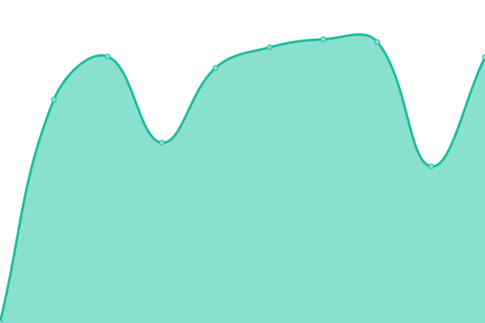
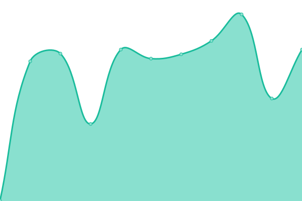

# [📈 ライブステータス](https://status.supernewroles.com): <!--live status--> **🟧 一部未稼働**

This repository contains the open-source uptime monitor and status page for [SuperNewRoles](https://github.com/SuperNewRoles/SuperNewRoles), powered by [Upptime](https://github.com/upptime/upptime).

With [Upptime](https://upptime.js.org), you can get your own unlimited and free uptime monitor and status page, powered entirely by a GitHub repository. We use [Issues](https://github.com/SuperNewRoles/SuperNewRolesStatus/issues) as incident reports, [Actions](https://github.com/SuperNewRoles/SuperNewRolesStatus/actions) as uptime monitors, and [Pages](https://status.supernewroles.com) for the status page.

## [📈 Live Status](https://demo.upptime.js.org): <!--live status--> **🟧 一部未稼働**

<!--start: status pages-->
<!-- This summary is generated by Upptime (https://github.com/upptime/upptime) -->
<!-- Do not edit this manually, your changes will be overwritten -->
<!-- prettier-ignore -->
| URL | 状態 | 履歴 | 応答時間 | 稼働時間 |
| --- | ------ | ------- | ------------- | ------ |
|  [CustomServer](https://cs.supernewroles.com) | 稼働中 | [custom-server.yml](https://github.com/SuperNewRoles/SuperNewRolesStatus/commits/HEAD/history/custom-server.yml) | 

 411ms
     
 | 

<a href="https://status.supernewroles.com/history/custom-server">100.00%</a>
    

|  [Matchmaker](https://matchmaker.supernewroles.com/ping) | 未稼働 | [matchmaker.yml](https://github.com/SuperNewRoles/SuperNewRolesStatus/commits/HEAD/history/matchmaker.yml) | 

 15890ms
     
 | 

<a href="https://status.supernewroles.com/history/matchmaker">0.00%</a>
    

|  [SuperNewRolesWeb](https://web.supernewroles.com/) | 稼働中 | [super-new-roles-web.yml](https://github.com/SuperNewRoles/SuperNewRolesStatus/commits/HEAD/history/super-new-roles-web.yml) | 

 294ms
     
 | 

<a href="https://status.supernewroles.com/history/super-new-roles-web">100.00%</a>
    

|  [Blacklist](https://blacklist.supernewroles.com/api/get_list?hash=true) | 稼働中 | [blacklist.yml](https://github.com/SuperNewRoles/SuperNewRolesStatus/commits/HEAD/history/blacklist.yml) | 

 157ms
     
 | 

<a href="https://status.supernewroles.com/history/blacklist">100.00%</a>
    

|  [NewAnalytics](https://analytics.supernewroles.com/ping) | 稼働中 | [new-analytics.yml](https://github.com/SuperNewRoles/SuperNewRolesStatus/commits/HEAD/history/new-analytics.yml) | 

 469ms
     
 | 

<a href="https://status.supernewroles.com/history/new-analytics">100.00%</a>
    

|  [Reports api](https://reports-api.supernewroles.com/) | 稼働中 | [reports-api.yml](https://github.com/SuperNewRoles/SuperNewRolesStatus/commits/HEAD/history/reports-api.yml) | 

 456ms
     
 | 

<a href="https://status.supernewroles.com/history/reports-api">100.00%</a>
    

|  [Reports api v1](https://reports-api.supernewroles.com/) | 稼働中 | [reports-api-v1.yml](https://github.com/SuperNewRoles/SuperNewRolesStatus/commits/HEAD/history/reports-api-v1.yml) | 

 190ms
     
 | 

<a href="https://status.supernewroles.com/history/reports-api-v1">100.00%</a>
    

|  [Reports api v2](https://reports-api.supernewroles.com/api/v2) | 稼働中 | [reports-api-v2.yml](https://github.com/SuperNewRoles/SuperNewRolesStatus/commits/HEAD/history/reports-api-v2.yml) | 

 405ms
     
 | 

<a href="https://status.supernewroles.com/history/reports-api-v2">100.00%</a>
    

|  [Reports api v3](https://reports-api.supernewroles.com/api/v3) | 稼働中 | [reports-api-v3.yml](https://github.com/SuperNewRoles/SuperNewRolesStatus/commits/HEAD/history/reports-api-v3.yml) | 

 357ms
     
 | 

<a href="https://status.supernewroles.com/history/reports-api-v3">100.00%</a>
    

<!--end: status pages-->

[**Visit our status website →**](https://status.supernewroles.com)

## 📄 License

- Powered by: [Upptime](https://github.com/upptime/upptime)
- Code: [MIT](./LICENSE) © [SuperNewRoles](https://github.com/SuperNewRoles/SuperNewRoles)
- Data in the `./history` directory: [Open Database License](https://opendatacommons.org/licenses/odbl/1-0/)
